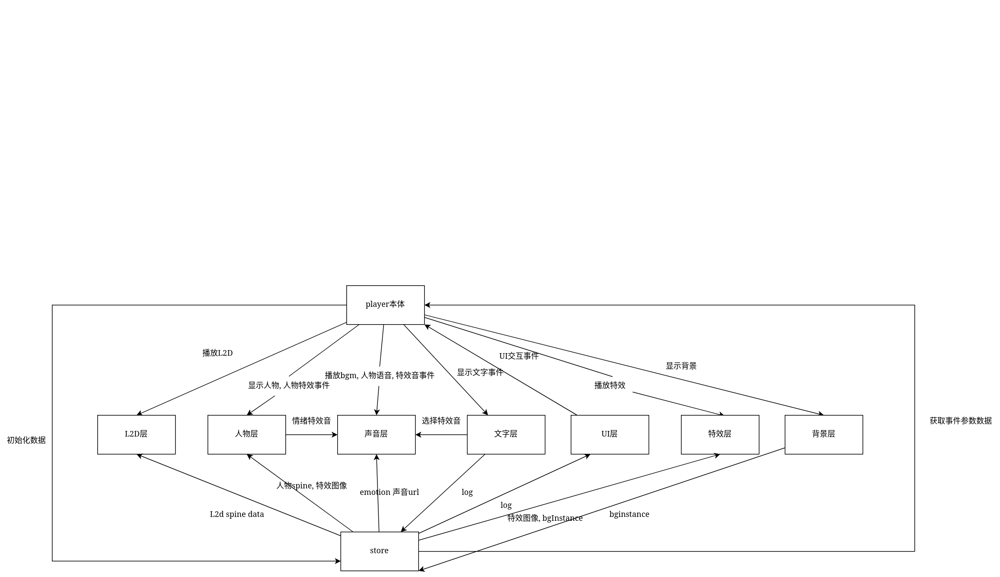

# 概括

首先非常欢迎, 也非常感谢您愿意为这个兴趣使然的项目添砖加瓦.

为方便与项目管理, 请开启新分支进行代码贡献.

剧情播放器采用了 pixi.js+gsap+vue 的技术栈, 编程语言主要为 ts. 在贡献代码之前推荐先阅读这些框架与语言的官方文档确保有一定的基础.

本剧情播放器采用了事件总线的设计模式, 并将功能模块化, 抽象为一个个层方便协助开发与后续维护.

整体架构:

# 各层简易说明

## 本体

本体主要用于更改当前剧情信息.

同时, 本体还负责发出事件, 它是各层协同工作的桥梁.

## store

store 充当一个统一的数据交换中心, 获取资源和与其他层资源交互都在这里进行.

## 特效层

特效层用于播放除人物相关特效外的特效

## 人物层

人物层负责处理人物的显示, 人物特效, 人物动作.

## 背景层

背景层负责背景. 它在改变的同时会更新背景实例信息.

## l2d 层

l2d 层负责 l2d 的显示

## UI 层

UI 层负责 UI 的相关功能

## 文字层

文字层负责有对话框文字, 无对话框文字, 选项的显示.

文字层同时需要更新历史剧情信息与选项选择信息.

# 各层代码贡献说明

请阅读[接口与事件文档](./layers.md), 在其中获取各层需要处理的事件与数据并实现.

目前尚未完成的层:

- 声音层
- 文字层(半成品)
- L2D 层(未知)
- 特效层
- UI 层

对于内容庞大, 持续更新的层, 请根据该层实现者的文档进行代码贡献.

[人物层](./layers/characterLayer.md)

[特效层](./layers/effectLayer.md)
