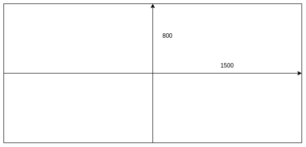

# 通用

每层需提供一个 init 函数用于注册 event handler(如果是组件类型则需自行使用 eventBus 注册).

## 资源访问

通过`@/stores`的`usePlayerStore`获取资源工具类, 注意请获取整个对象而不是某个属性, 不然可能会导致数据过时.
可访问 getter:
`app`: pixi-Application 实例

## 事件管理

通过`eventBus.ts`导入`eventBus`.

## 接收事件

`hide`: 清除当前内容

# 人物层

人物层负责处理人物的显示, 人物特效, 人物动作.

## 接收事件

`showCharacter`
展示人物
参数:

```ts
interface ShowCharacter {
  characters: Character[];
  characterEffect: CharacterEffect[];
}
interface Character {
  position: number;
  CharacterName: number;
  face: number;
  highlight: boolean;
}

interface CharacterEffect {
  target: number; //注意指的是position
  type: "emotion" | "action" | "signal" | "fx";
  effect: string;
  async: boolean;
}
```

具体的人物特效请参考[剧情播放器人物特效索引表](https://github.com/ba-archive/blue-archive-story-viewer/issues/32)

## 发出事件

`characterDone`: 人物各种处理已完成
`playEmotionAudio`: 要求播放人物情绪特效语音

## 可使用的 getter

`characterSpineData`: 根据 CharacterName 获取 spineData
`emotionResources`: 获取人物情绪图片 url, 返回一个 string 数组, 图片的排列按从底部到顶部, 从左到右排列.

## 需要处理的 state

`currentCharacterList: CharacterInstance[]`: 当前显示的人物与其其其

# 背景层

背景层负责背景的显示

## 接收事件

`showBg`: 展示背景, 带一个 string 参数表示背景图片 url

## 需要处理的 state

`bgInstance`: 背景实例, 通过`setBgInstance`访问

# 声音层

声音层负责背景音乐, 效果音, 语音等的播放

## 接受事件

`playAudio`: 播放 bgm, sound, 或 voiceJP

参数:

```ts
export interface PlayAudio {
  bgm?: {
    url?: string;
    bgmArgs: BGMExcelTableItem;
  };
  soundUrl?: string;
  voiceJPUrl?: string;
}
```

`playEmotionAudio`: 播放人物情绪动作特效音, 参数是一个 string 代表人物的情绪动作

## 可使用 getter

`otherSoundUrl`: 获取其他声音资源 url

`emotionSoundUrl`: 获取 emotion 特效对应的特效音

# UI 层

UI 层负责 UI 的相关功能

## 发出事件

`skip`: 跳过剧情

`auto`: 启动自动模式

`stopAuto`: 自动模式停止

`hideDialog`: 隐藏对话框

`playOtherSound`: 参数: `select`. 播放选择时的特效音

## 接受事件

`hidemenu`: 隐藏 ui

`showmenu`: 显示 ui

`option`: 显示选项
参数: ShowOption[]

```ts
interface Option {
  SelectionGroup: number;
  text: string;
}
```

## 可使用 getter

`logText`: 已播放剧情语句

```ts
export interface LogText {
  /**
   * user: 用户选项
   * character: 人物对话, 有头像
   * none: 无所属对话, 此时name不存在
   */
  type: "user" | "character" | "none";
  text: string;
  /**
   * 人物名
   */
  name?: string;
  /**
   * 头像地址
   */
  avatarUrl?: string;
}
```

`storySummary`: 剧情梗概

```ts
export interface StorySummary {
  /**
   * 章节名
   */
  chapterName: string;
  /**
   * 简介
   */
  summary: string;
}
```

# 文字层

文字层剧情里没有交互的内容的显示(图片, 文字, 视频等)

## 发出事件

`titleDone`: 标题显示完成

`stDone`: st 文字显示完成

## 接收事件

`showTitle`: 显示标题, 接受一个 string 参数作为标题.

示例: [体香 1](https://www.bilibili.com/video/BV1qY411f72B?t=10.4)

`showPlace`: 显示地点, 接受一个 string 参数作为地点

示例: [体香 1](https://www.bilibili.com/video/BV1qY411f72B?t=14.0)

`showText`: 显示普通对话框文字
参数

```ts
export interface ShowText {
  text: Text[];
  speaker?: Speaker;
}
interface Text {
  content: string;
  effect: TextEffect[];
  waitTime?: number;
}
interface TextEffect {
  name: "color" | "fontsize" | "ruby";
  value: string[];
  textIndex: number;
}
```

`st`: 显示无对话框文字
参数:

```ts
interface StText {
  text: Text[];
  stArgs: [number[], "serial" | "instant", number];
}
```

stArgs:
第一个参数代表位置, 一般由两个数组成
位置示意图:

注意 100 单位长度的位置应大于等于文字默认高度

第二个参数代表效果, serial 打字机效果, instant 立即全部显示, smooth 表示 fade in

第三个参数目前尚不明确

参数例子:[[-1200,-530],'serial',60](体香 1 L2d 第一句)

`clearSt`: 清除无对话框文字

`hideDialog`: 隐藏对话框

`popupImage`: 显示弹出的图片, 参数是图片 url

`popupVideo`: 显示弹出的视频, 参数是视频地址

`toBeContinue`: 显示未完待续

`nextEpisode`: 显示下一章节
type

```js
{
  title: string;
  text: string;
}
```

## 发出事件

`next`: 进入下一语句

`select`: 选择后加入下一剧情语句, 需要带一个 number 类型的参数

## 需要处理的 state

`logText`: 已播放剧情语句, 通过`setLogText`进行修改.

# 特效层

特效层用于播放除人物相关特效外的特效

## 接收事件

`playEffect`: 播放特效

## 发出事件

`effectDone`: 特效播放完成时发出的事件

# L2D 层

L2D 层用于播放 L2D

## live2D 动画

关于查看 spine 中有的动画, 参考 https://www.bilibili.com/read/cv18073492

## 发出事件

`animationDone`: 当前 l2d 动画播放完成

## 接收事件

`playL2D`: 加载 L2D, 播放 l2d 初始动画

`changeAnimation`: 更换动画, 接受一个 string 参数作为动画名

`endL2D`: 停止 L2D

## 可使用 getter

`l2dSpineData`: 获取 l2d 的 spine 数据
